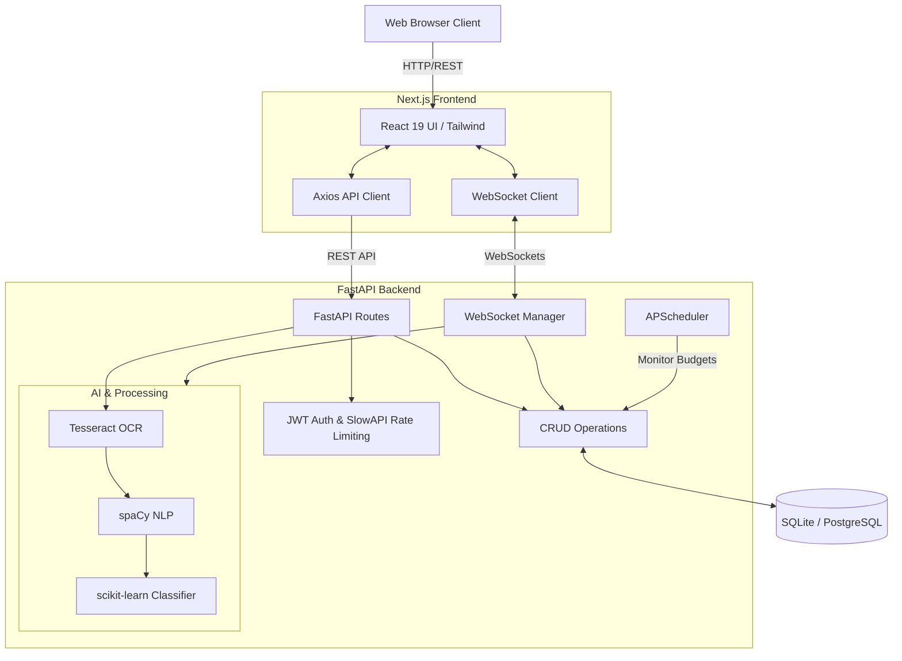

# Smart Spend 💰

A full-stack expense tracking application with AI-powered features for intelligent expense management.

## 🏗️ System Architecture



## 🚀 Features in Detail

### 💬 Smart Chat Interface
- **Natural Language Processing**: Built with `spaCy` to extract expense details automatically from chat (e.g., "Spent ₹500 on groceries").
- **Automatic Categorization**: Uses a scikit-learn machine learning model (`category_model.pkl`) to automatically categorize expenses into predefined buckets (Food, Shopping, Transport, Bills, Entertainment, Other).
- **Intelligent Entity Extraction**: Accurately pulls out amount, date, and merchant/vendor from conversational input.
- **Real-time WebSocket Updates**: The chat interface is connected via WebSockets, allowing instant feedback and seamless interaction without refreshing the page.

### 📸 Receipt OCR Processing
- **Image Text Extraction**: Uses `Tesseract OCR` to read receipt images and extract raw text.
- **Data Parsing**: Feeds the OCR-extracted text directly into the NLP pipeline to intelligently pick out the total amount, merchant name, date, and predict the expense category.

### 📊 Budget Goals & Optimization
- **Category Budgets**: Set specific monthly spending limits for each category.
- **Alerts & Warnings**: Uses `APScheduler` to regularly check user spending against budgets. Triggers warnings when spending reaches 80% and alerts when over budget.
- **Anomaly Detection**: Flags unusual spending patterns (using statistical methods like Z-score and IQR) when an expense significantly deviates from your usual spending behavior.

### 📈 Analytics & Spending Forecasts
- **Monthly Summaries**: View aggregated spending data organized by month and category, complete with total spent and budget usage percentages.
- **Predictive Forecasting**: Leverages historical spending trends to predict future monthly expenses (up to 3 months ahead), helping you plan better and avoid overspending.

### 📁 Bulk CSV Import
- **Historical Data Processing**: Upload bank statements or historical expenses via CSV/TXT files to instantly populate your dashboard and train the analytics engine.

## 🛠️ Tech Stack

### Frontend
- **Framework**: Next.js 16 with React 19
- **Styling**: Tailwind CSS
- **Charts**: Recharts
- **Icons**: Lucide React
- **HTTP Client**: Axios

### Backend
- **Framework**: FastAPI (Python 3.11+)
- **Database**: SQLite (Development) / PostgreSQL-ready (Production)
- **ORM**: SQLAlchemy
- **AI/ML**: spaCy, scikit-learn, Tesseract OCR
- **Authentication**: JWT with Bcrypt password hashing
- **Rate Limiting**: SlowAPI
- **Scheduler**: APScheduler for background budget monitoring

## ⚙️ Prerequisites

- **Node.js** 18+ and npm
- **Python** 3.11+
- **Tesseract OCR** (required for receipt processing)

### Installing Tesseract

**macOS:**
```bash
brew install tesseract
```

**Ubuntu/Debian:**
```bash
sudo apt-get install tesseract-ocr
```

**Windows:**
Download from [GitHub Releases](https://github.com/UB-Mannheim/tesseract/wiki)

## 💻 Local Development Setup

### 1. Clone the Repository

```bash
git clone <your-repo-url>
cd "Smart Spend"
```

### 2. Backend Setup

```bash
cd backend

# Create and activate virtual environment
python -m venv venv
source venv/bin/activate  # On Windows: venv\Scripts\activate

# Install dependencies
pip install -r requirements.txt

# Download spaCy model
python download_models.py

# Create .env file from example
cp .env.example .env

# Run the backend
uvicorn app.main:app --reload --host 0.0.0.0 --port 8000
```
*The backend API and Swagger UI will be available at `http://localhost:8000/docs`.*

### 3. Frontend Setup

```bash
cd frontend

# Install dependencies
npm install

# Create .env.local file with the correct environment variables
echo "NEXT_PUBLIC_API_URL=http://localhost:8000" > .env.local
echo "NEXT_PUBLIC_WS_URL=ws://localhost:8000" >> .env.local

# Run the frontend development server
npm run dev
```
*The frontend will be available at `http://localhost:3000`.*

## 🐳 Docker Deployment

The project includes a `docker-compose.yml` for simplified deployment:

```bash
# Build and run all services (frontend and backend)
docker-compose up -d --build
```
- Frontend: `http://localhost:3000`
- Backend API: `http://localhost:8000`

## 🔐 Environment Variables

### Backend (`backend/.env`)

```bash
ENVIRONMENT=development
DATABASE_URL=sqlite:///./expenses.db
JWT_SECRET=your-secret-key-here
RUN_SCHEDULER=true
```

### Frontend (`frontend/.env.local`)

```bash
NEXT_PUBLIC_API_URL=http://localhost:8000
NEXT_PUBLIC_WS_URL=ws://localhost:8000
```

## 🤝 Contributing

1. Fork the repository
2. Create a feature branch (`git checkout -b feature/amazing-feature`)
3. Commit your changes (`git commit -m 'Add amazing feature'`)
4. Push to the branch (`git push origin feature/amazing-feature`)
5. Open a Pull Request

## 📄 License
This project is licensed under the MIT License.